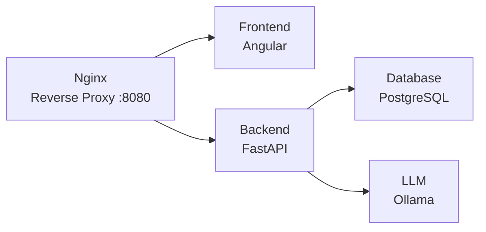

# Digital Phone Book

A contact management web application with an AI-powered chat assistant. Manage contacts through a traditional list interface or by chatting with an LLM in natural language.

## Demo

Click the badge below to watch a demo

[](https://youtu.be/ijtmLfg_Gzc)

## Features

- **Contact Management** — full CRUD operations via a REST API and an interactive table UI
- **AI Chat Assistant** — converse with an LLM to look up, add, update, or delete contacts using natural language
- **Interactive UI Cards** — the assistant renders rich contact cards (powered by [A2UI](https://a2ui.org/)) with action buttons (Call, Edit, Delete) directly in the chat
- **Real-time Streaming** — LLM responses are streamed token-by-token via NDJSON for instant feedback
- **Fully Containerized** — one-command setup with Docker Compose (5 services)

## Tech Stack

| Layer    | Technology                         |
| -------- | ---------------------------------- |
| Frontend | Angular 21, PrimeNG, TypeScript    |
| Backend  | FastAPI, SQLAlchemy, Alembic       |
| Database | PostgreSQL 18                      |
| LLM      | Ollama with Qwen 2.5 3B, LangChain |
| Proxy    | Nginx                              |

## Architecture



## Getting Started

### Prerequisites

- [Docker](https://docs.docker.com/get-docker/) & [Docker Compose](https://docs.docker.com/compose/install/)
- [Git](https://git-scm.com/install/)
- ~7 GB disk space for Docker images
- ~3 GB free RAM for all 5 running containers

### Setup

```bash
git clone git@github.com:R-Ohman/digital-phone-book.git
cd digital-phone-book
cp .env.example .env
```

Fill in the required environment variables in `.env`:

| Variable                | Description              |
| ----------------------- | ------------------------ |
| `PHONEBOOK_DB`          | PostgreSQL database name |
| `PHONEBOOK_DB_USER`     | PostgreSQL username      |
| `PHONEBOOK_DB_PASSWORD` | PostgreSQL password      |

### Run

```bash
docker compose up -d --build
```

Once all services are healthy, open [http://localhost:8080](http://localhost:8080) in your browser.

> **Note:** The first startup may take a few minutes while the Ollama container downloads the Qwen 2.5 3B model.

## Usage

- **Left panel** — browse, add, edit, and delete contacts via the table interface
- **Right panel** — type a message to the AI assistant (e.g., _"Add John Doe with number 123-456-7890"_ or _"Find all contacts"_) and interact with the returned contact cards

## Performance Testing

Run performance tests with k6 using the Docker Compose `perf` profile:

```bash
docker compose --profile perf run --rm k6
docker compose --profile perf run --rm k6-llm
```

The `k6` runner executes `performance/k6/contacts-api.js` for contact CRUD endpoint load testing.

The `k6-llm` runner executes `performance/k6/llm-stream.js` for LLM-driven CRUD load testing over the streaming endpoint (`/api/llm/prompt/stream`).

For more details and customization options, see `performance/README.md`.
